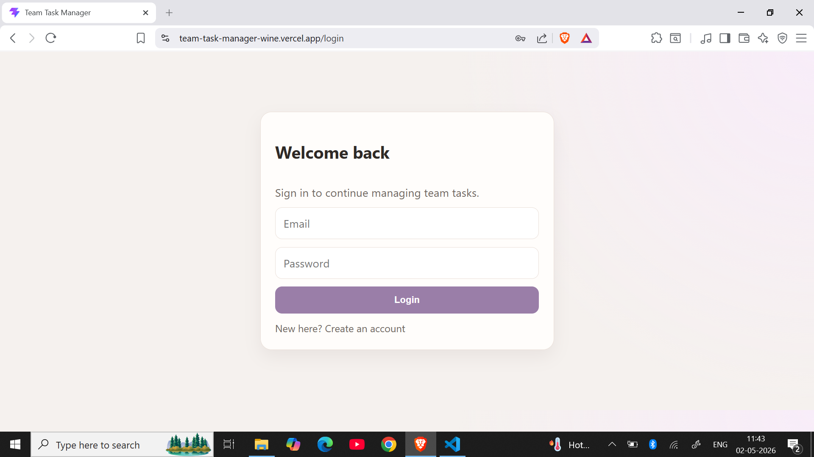
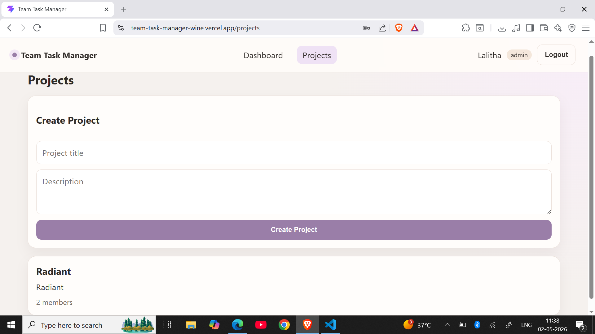
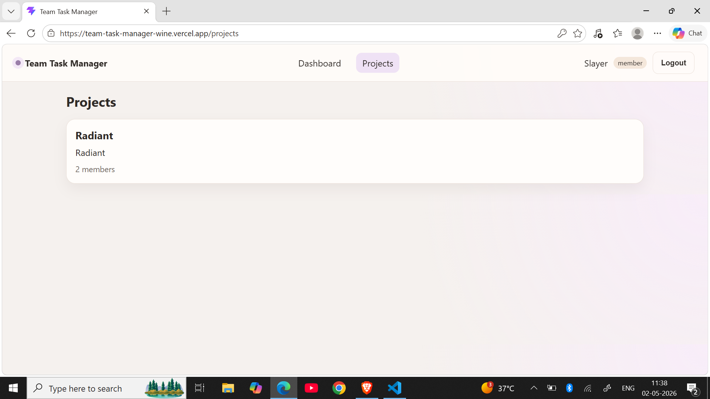
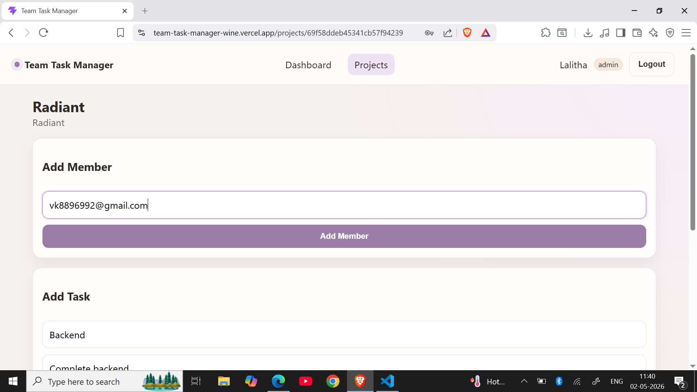
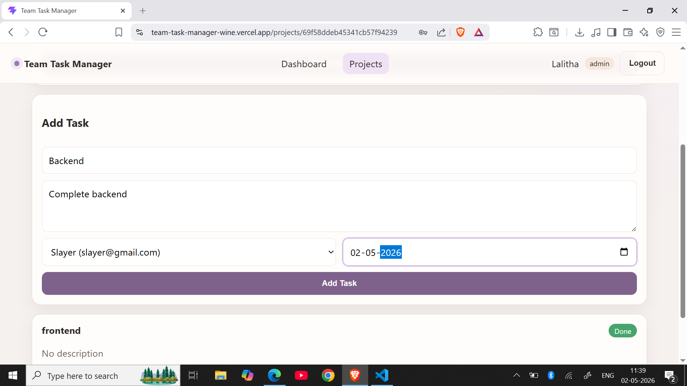
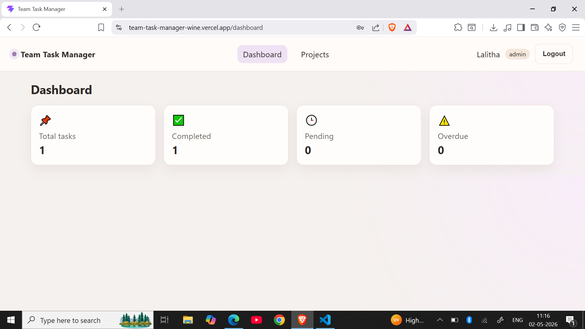
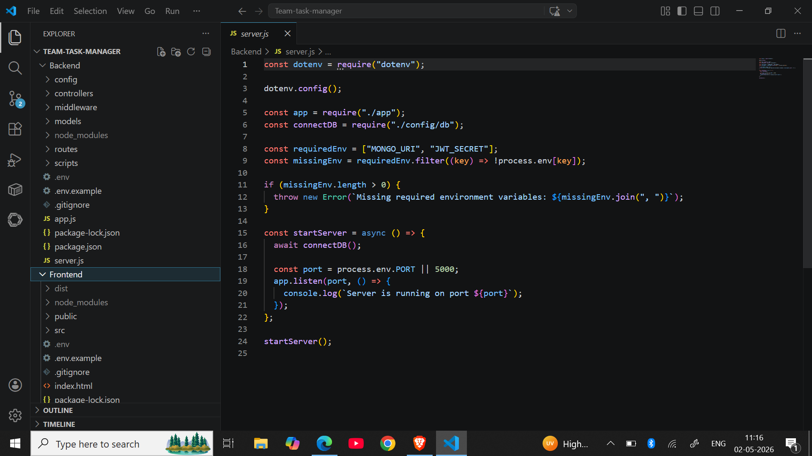

# 📌 Team Task Manager


A full-stack web application that allows teams to create projects,
assign tasks, and track progress with role-based access control (Admin &
Member).

------------------------------------------------------------------------

## 🚀 Live Demo

-   🌐 Frontend: https://team-task-manager-wine.vercel.app/
-   🔗 Backend API:
    https://team-task-manager-backend-it06.onrender.com/api

------------------------------------------------------------------------

## 📽️ Demo Video

👉 https://www.loom.com/share/247974b510024825b578e9d88f7421d2

------------------------------------------------------------------------

## 📸 Screenshots

## 📸 Screenshots

### 🔐 Login Page


### 📁 Project Creation


### 📂 Projects Page


### 👥 Add Member


### 📋 Assign Task


### 📊 Dashboard


### 💻 Code Structure


------------------------------------------------------------------------

## ✨ Features

### 🔐 Authentication

-   User Signup & Login
-   JWT-based authentication
-   Secure password hashing

### 👥 Role-Based Access

-   **Admin**
    -   Create projects
    -   Add members via email
    -   Assign tasks
-   **Member**
    -   View assigned tasks
    -   Update task status

### 📁 Project Management

-   Create and manage projects
-   Add team members

### 📋 Task Management

-   Create tasks with:
    -   Title
    -   Description
    -   Due date
-   Assign tasks to users
-   Update status:
    -   Todo
    -   In Progress
    -   Done

### 📊 Dashboard

-   Total tasks
-   Completed tasks
-   Pending tasks
-   Overdue tasks

------------------------------------------------------------------------

## 🧠 Workflow

1.  User registers and logs in\
2.  Admin creates a project\
3.  Admin adds members via email\
4.  Admin creates and assigns tasks\
5.  Members update task status\
6.  Dashboard reflects progress

------------------------------------------------------------------------

## 🛠️ Tech Stack

Frontend: React (Vite)\
Backend: Node.js, Express.js\
Database: MongoDB Atlas\
Deployment: Vercel (Frontend), Render (Backend)

------------------------------------------------------------------------

## 📂 Project Structure

backend/ frontend/

------------------------------------------------------------------------

## ⚙️ Environment Variables

### Backend

PORT=5000\
MONGO_URI=your_mongodb_atlas_url\
JWT_SECRET=your_secret_key\
CORS_ORIGIN=https://team-task-manager-wine.vercel.app

### Frontend

VITE_API_URL=https://team-task-manager-backend-it06.onrender.com/api

------------------------------------------------------------------------

## 💻 Setup

``` bash
git clone <repo>
cd backend && npm install && npm run dev
cd frontend && npm install && npm run dev
```

------------------------------------------------------------------------

## 🌍 Deployment

-   Backend → Render\
-   Frontend → Vercel\
-   Database → MongoDB Atlas

------------------------------------------------------------------------

## 🔒 Security

-   JWT authentication\
-   Protected routes\
-   Environment variables

------------------------------------------------------------------------

## 🚧 Future Improvements

-   Notifications\
-   File uploads\
-   Real-time updates

------------------------------------------------------------------------

## 👨‍💻 Author

Ravi Kiran
https://github.com/Ravikiran9988

------------------------------------------------------------------------

## ⭐ Conclusion

A complete full-stack project demonstrating authentication, role-based
access, and task management with deployment.
